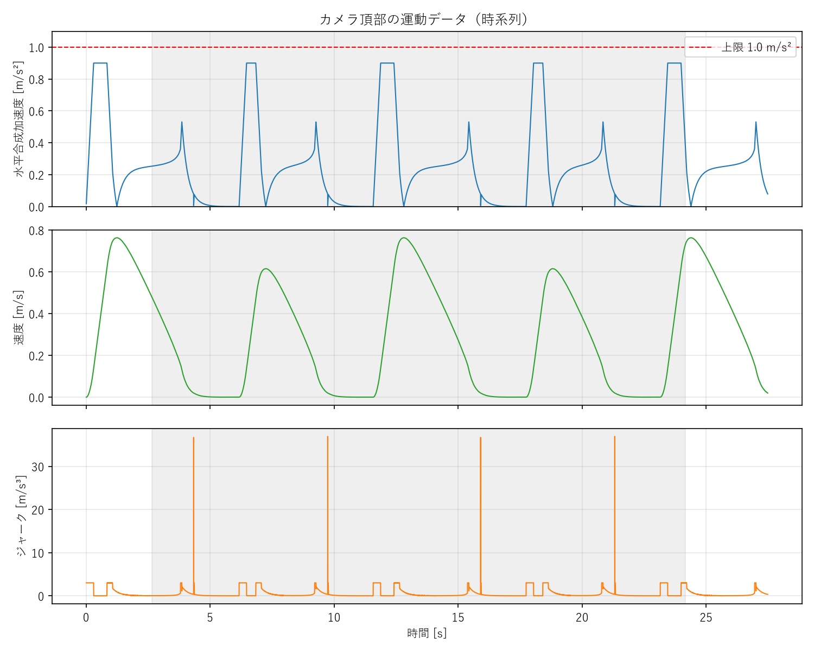

# robocon-cleaner-sim

**ロボット掃除機＋見守りカメラを2輪差動駆動でモデル化し、S字クランクのコースを加速度制約を守りながら自動走破するUnityシミュレーション。**

「ロボット制御工学」期末レポート課題（ロボット掃除機＋見守りカメラのシミュレーションロボコン）の提出物。加速度制御と走行ルート制御を行い、コース走破時間を計測する。

<!-- TODO: 走行中の様子のスクリーンショット or GIF をここに追加（例: docs/run.png） -->

## 目次

- [概要](#概要)
- [動作環境](#動作環境)
- [使い方](#使い方)
- [プロジェクト構成](#プロジェクト構成)
- [制御の考え方](#制御の考え方)
- [調整パラメータ](#調整パラメータ)
- [結果](#結果)
- [必須条件との対応](#必須条件との対応)
- [クレジット](#クレジット)

## 概要

- **コース**: 全体 2400 × 3000 mm、通路幅 600 mm の S字クランク（上面図）。右下スタート → 左下 → 中段 → 上段 → 左上ゴールへ。
- **装置**: 直径 0.30 m の掃除機本体＋高さ 1.00 m の見守りカメラ。全質量 10 kg、重心高さ 0.50 m。
- **駆動**: 平行2輪の差動駆動。前進・後退・停止・その場旋回（超信地旋回）が可能。
- **制約の要点**: カメラ頂部（床から 1.0 m）の水平合成加速度を **常に 1.0 m/s² 以下** に保つ。位置の瞬間移動は禁止で、すべて Rigidbody の力・トルクで駆動する。

## 動作環境

| 項目 | バージョン / 値 |
|---|---|
| Unity | 6000.3.17f1（Unity 6.3 LTS） |
| 物理 | Rigidbody（Collision Detection: Continuous Dynamic） |
| Fixed Timestep | **0.002 s**（シミュレーション中一定） |
| グラフ生成（任意） | Python 3 + matplotlib |

## 使い方

### シミュレーションを走らせる

1. リポジトリを取得する。
   ```bash
   git clone https://github.com/YonezawaYuichiro/robocon-cleaner-sim.git
   ```
2. Unity Hub から **Unity 6000.3.17f1** でプロジェクトを開く。
3. `Assets/Scenes/SampleScene.unity` を開く。
4. ヒエラルキーの各オブジェクトをコンポーネントメニュー（⋮）から生成する（初回のみ）。
   - `CourseBuilder` → **コースを生成する**
   - `Robot`（RobotBuilder）→ **機体を組み立てる**
5. **▶ Play** を押すと、ロボットがコースを自動走破する。
6. 走破後、Console に結果サマリが出力され、プロジェクト直下に `RunData.csv`（時系列データ）が書き出される。

### 加速度グラフを生成する（任意）

```bash
python plot_run.py
```

`RunData.csv` を読み込み、加速度・速度・ジャークの時系列グラフ `RunData_plot.png` を出力する。

## プロジェクト構成

```
robocon-cleaner-sim/
├─ Assets/
│  ├─ Scenes/SampleScene.unity      # 走行シーン
│  ├─ Scripts/
│  │  ├─ RobotController.cs         # 走行・旋回・加速度制限・計測（本体）
│  │  ├─ RobotBuilder.cs            # ロボット（車体・カメラ・車輪）を自動生成
│  │  └─ CourseBuilder.cs           # コース（壁・スタート/ゴール線）を自動生成
│  └─ NoFriction.physicMaterial     # 路面摩擦0（駆動は自前モデルで表現）
├─ plot_run.py                      # CSV → グラフPNG 生成
├─ RunData.csv                      # 走行の時系列データ
└─ RunData_plot.png                 # 加速度・速度・ジャークの時系列グラフ
```

- 制御の中身は [Assets/Scripts/RobotController.cs](Assets/Scripts/RobotController.cs) に、初心者向けの詳しい解説コメント付きでまとめてある。

## 制御の考え方

- **2輪差動駆動のモデル化**: 前進力とヨートルクを、左右2輪それぞれの駆動力に分解し、`AddForceAtPosition` で車輪位置に加える。左右同力で前進、逆向きで中心まわりの旋回。
- **加速度制約の遵守**: 直進の加速度を上限以下に制限し、ジャーク（加速度の変化率）も制限。旋回は「その場回転」にすることで、カメラ頂部（回転軸上）の水平加速度をほぼ 0 に抑える。
- **時間最適な直進**: 残り距離から到達可能な目標速度を逆算する減速プロファイルで、加速度上限内で素早く走る。
- **計測**: カメラ頂部の速度を差分して合成加速度・ジャークを実測。スタート/ゴールラインのトリガー通過で走破時間を計測し、CSVに出力。

## 調整パラメータ

Inspector（RobotController）で調整できる主なつまみ。

| パラメータ | 既定値 | 効果 |
|---|---|---|
| `maxCamAccel` | 1.0 | カメラ頂部の水平加速度の上限（ルール値。基本固定） |
| `accelSafety` | 0.9 | 上限に対して実際に使う割合。大→速いが上限ギリギリ |
| `brakeSafety` | 0.35 | 小→早めに減速（安全・遅い）／大→ギリギリ減速（速いが突っ込みリスク） |
| `maxJerk` | 3.0 | 加速度の変化率上限。小→なめらか／大→機敏だがジャーク増 |
| `headingKp` / `headingKd` | 20 / 9 | 方位保持PD（旋回・直進のまっすぐ維持） |

## 結果



| 指標 | 値 |
|---|---|
| 走破時間 | 21.511 s |
| 最大合成加速度（カメラ頂部） | ≤ 1.0 m/s²（ピーク約 0.9、上限を超えない） |
| Fixed Timestep | 0.002 s |

- グラフ上段のとおり、加速度は上限 1.0 m/s²（赤破線）を一度も超えていない。
- 旋回中は合成加速度がほぼ 0 に落ちている（中心まわり旋回のため）。
- 灰色の帯が計測区間（スタート〜ゴール）。帯の外はスタートライン手前の助走。

<!-- TODO: 走破時間などの数値は最新の実行結果に合わせて更新 -->

## 必須条件との対応

| 必須条件 | 対応箇所 |
|---|---|
| 物理演算・衝突判定を使用 | Rigidbody ＋ Collider（Continuous Dynamic） |
| Fixed Timestep を明示・一定 | 0.002 s（Project Settings / Time） |
| Rigidbody による剛体 | `RobotBuilder.cs` で構成 |
| 直径0.30m / カメラ1.0m / 質量10kg / 重心0.5m | `RobotBuilder.cs`（諸元をInspectorで設定） |
| 2輪差動駆動・各種旋回 | `RobotController.cs`（ApplyWheelForces / Spin） |
| カメラ頂部の水平加速度 ≤ 1.0 m/s² | `RobotController.cs`（加速度・ジャーク制限＋実測） |
| Transform瞬間移動の禁止（物理駆動） | すべて `AddForce` / `AddForceAtPosition` で駆動 |
| Continuous系の衝突判定 | Continuous Dynamic |
| 壁接触・転倒等の検出 | `OnCollisionEnter`（壁接触を警告）＋回転X/Z固定で転倒回避 |

## クレジット

- Unity 6 / 物理エンジン
- グラフ生成: Python + matplotlib

<!-- TODO: ライセンスを決める場合は LICENSE ファイルを追加し、ここに記載（現状ライセンス未設定） -->
